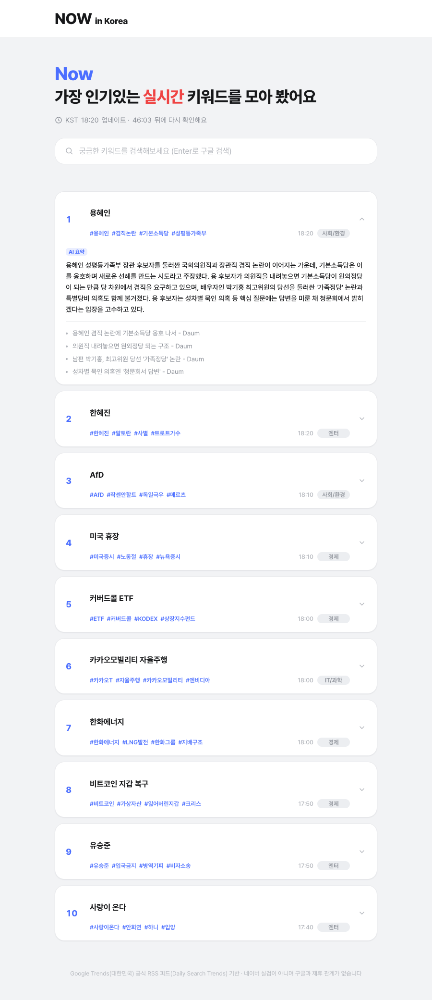

# NOW in Korea

> 🗂️ **포트폴리오 보존용 저장소입니다.** 실제 서비스 운영은 종료되었고, 더 이상 배포되어 있지 않습니다 (2026년 9월 한 달간 실제 배포·운영). 아래 스크린샷과 코드로 결과물을 확인하실 수 있고, `npm install && npm start`로 로컬에서 그대로 재현해볼 수 있습니다.

Google Trends 공식 RSS(Daily Search Trends)를 기반으로 실시간 인기 검색어를 모아 보여주는 웹앱입니다. 각 키워드에 관련 뉴스 링크와 AI 요약을 함께 붙여줍니다. 한국(KR)/일본(JP)/미국(US)/영국(GB)/독일(DE) 다섯 지역을 지원합니다.

> 네이버 실검이 아니며, 구글과 제휴 관계가 없습니다.

## 스크린샷

| 데스크톱 | 모바일 |
|---|---|
|  |  |

## 주요 기능

- Google Trends RSS에서 실시간 인기 검색어 Top 10 수집
- 키워드별 관련 뉴스 기사 링크 및 본문 첨부
- AI 요약/카테고리/해시태그 자동 태깅, 직전 수집 대비 순위 변동(▲▼NEW) 표시
- 1시간 주기로 자동 갱신 (백그라운드 스케줄러), 데이터가 오래되면 방문 시점에 자동 복구(self-heal)
- SEO 기본기: 메타 설명·OG 태그, `robots.txt`/`sitemap.xml` 자동 생성, Google/Naver 서치콘솔 연동

## 동작 구조

수집·요약 작업과 서빙을 분리한 구조입니다. 요약 작업은 실행 환경에 따라 두 가지 방식 중 하나로 동작합니다.

```
[로컬 개발] scripts/enrich.sh (launchd, 1시간마다)
  1. scripts/fetch-trends.js  → Google Trends RSS 수집 → data/pending.json
  2. scripts/build-prompt.js  → 국가별 프롬프트 생성   → data/prompt.generated.txt
  3. claude CLI                → 키워드 요약/카테고리   → data/enrichment.json

[클라우드 배포] lib/enrichment.js (server.js 안에서 1시간마다 자체 실행, GEMINI_API_KEY 필요)
  → 트렌드 수집 → Gemini API 호출 → data/enrichment.json
  → launchd나 claude CLI 없이 서버 프로세스 하나로 완결됨

server.js
  → data/pending.json + data/enrichment.json를 읽어서 서빙만 함
  → 요청마다 디스크를 다시 읽지 않도록 30초간 메모리 캐시
  → pending.json이 2시간 이상 오래되면 방문 시점에 백그라운드로 재수집
    (GEMINI_API_KEY가 있으면 lib/enrichment.js, 없으면 scripts/enrich.sh)
```

어느 방식을 쓸지는 `GEMINI_API_KEY` 환경변수 존재 여부로 자동 결정됩니다. 로컬 macOS 개발 환경에선 비워두고 launchd + claude CLI를 그대로 쓰면 되고, 클라우드에 배포할 때만 채워주면 됩니다.

## 시작하기

### 설치

```bash
npm install
```

### 환경변수 설정

```bash
cp .env.example .env
```

`.env` 파일에서 국가를 설정합니다.

| 변수 | 설명 | 값 |
|---|---|---|
| `COUNTRY` | 서비스 지역 | `KR`, `JP`, `US`, `GB`, `DE` 중 하나 |
| `GEMINI_API_KEY` | 클라우드 배포 시에만 필요 | [aistudio.google.com/apikey](https://aistudio.google.com/apikey)에서 발급 |
| `GEMINI_MODEL` | 선택. 요약에 쓸 모델 | 기본값 `gemini-3.6-flash` |

### 실행

```bash
npm start
```

기본적으로 `http://localhost:3000`에서 확인할 수 있습니다.

> 최초 실행 시 `data/pending.json`이 없으면 서버가 직접 한 번 수집합니다. 이후 주기적인 자동 갱신은, 로컬에서는 `scripts/enrich.sh`를 launchd(또는 cron)에 등록해서, 클라우드에서는 `GEMINI_API_KEY`를 설정해 서버 자체 스케줄러로 처리합니다.

## 이 프로젝트에서 다룬 것들

실제로 운영하면서 부딪히고 해결한 것들입니다.

- **환경변수 하나로 갈리는 이원화 아키텍처**: 로컬(macOS launchd + Claude CLI)과 클라우드(Railway + Gemini API) 두 실행 환경이 `GEMINI_API_KEY` 존재 여부만으로 자동 분기 — 로컬 개발 흐름을 안 건드리고 클라우드 배포를 추가함
- **운영 중 모델 폐기 대응**: 배포 직후 `gemini-2.5-flash`가 신규 사용자에게 지원 중단되며 프로덕션 장애 발생 → API 에러 메시지로 원인 파악 후 핫픽스
- **SEO 파이프라인**: 동적 `robots.txt`/`sitemap.xml`, Google Search Console·네이버 서치어드바이저 소유확인 자동화(환경변수만 추가하면 `<head>`에 반영)

## 기술 스택

- [Express](https://expressjs.com/) — 웹 서버
- [fast-xml-parser](https://github.com/NaturalIntelligence/fast-xml-parser) — Google Trends RSS 파싱
- [dotenv](https://github.com/motdotla/dotenv) — 환경변수 관리
- [Claude CLI](https://docs.claude.com/en/docs/claude-code) — 키워드 요약/카테고리 생성 (로컬)
- [Gemini API (@google/genai)](https://github.com/googleapis/js-genai) — 키워드 요약/카테고리 생성 (클라우드)

## 프로젝트 구조

```
server.js                    # 요청 처리, 캐시, self-heal 트리거, 클라우드 스케줄러
config.js                    # 국가별 설정(KR/JP/US/GB/DE)
lib/
  trends-fetcher.js           # Google Trends RSS 수집·파싱
  article-fetcher.js          # 뉴스 기사 본문 스크래핑
  news-search.js               # 로컬 뉴스 검색
  enrichment.js                 # Gemini API 기반 요약 파이프라인 (클라우드용)
scripts/
  fetch-trends.js               # pending.json 갱신 (로컬 수동 실행용)
  build-prompt.js                 # claude CLI용 프롬프트 생성
  enrich-prompt-api.template.txt   # Gemini API용 프롬프트 템플릿
  enrich.sh                         # 전체 파이프라인 실행 (로컬 launchd)
views/index.html                # 메인 페이지 템플릿
public/                         # 정적 리소스 (JS/CSS)
```

## 배포 (Railway)

1. 이 저장소를 GitHub에 push해둡니다 (완료됨).
2. [railway.app](https://railway.app)에 GitHub 계정으로 로그인합니다.
3. **New Project → Deploy from GitHub repo**에서 이 저장소를 선택합니다. `package.json`의 `npm start`를 자동으로 인식해 빌드·실행합니다.
4. 프로젝트의 **Variables** 탭에서 환경변수를 등록합니다.
   - `COUNTRY` (예: `KR`)
   - `GEMINI_API_KEY` (Google AI Studio에서 발급한 값)
5. **Settings → Networking → Generate Domain**으로 공개 URL을 발급받습니다.

> 클라우드 컨테이너의 `data/` 디렉터리는 재배포 시 초기화됩니다. 서버가 시작할 때 `pending.json`이 없으면 자동으로 다시 수집하므로 동작엔 문제없지만, 재배포 직후 첫 방문은 초기 수집이 끝날 때까지 몇 초 더 걸릴 수 있습니다.
